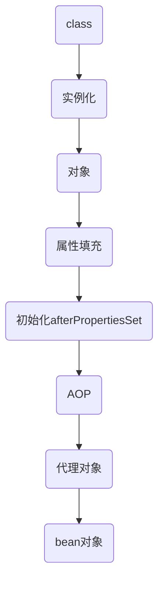

# spring-study

#### 介绍
>本项目是用于学习spring框架使用

#### SpringBean创建的生命周期

```mermaid
graph TB
1(class)
2(实例化)
3(对象)
4(属性填充)
5(初始化afterPropertiesSet)
6(AOP)
7(代理对象)
8(bean对象)
1-->2
2-->3
3-->4
4-->5
5-->6
6-->7
7-->8
```